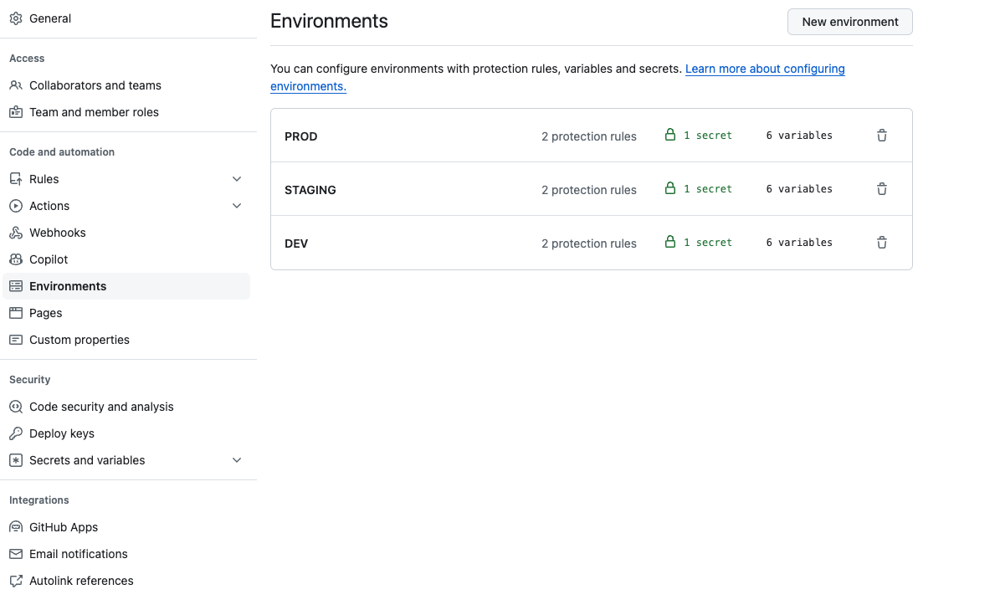
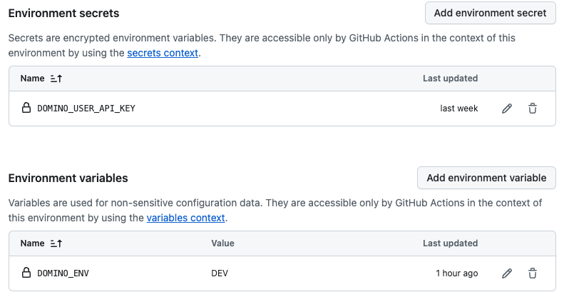
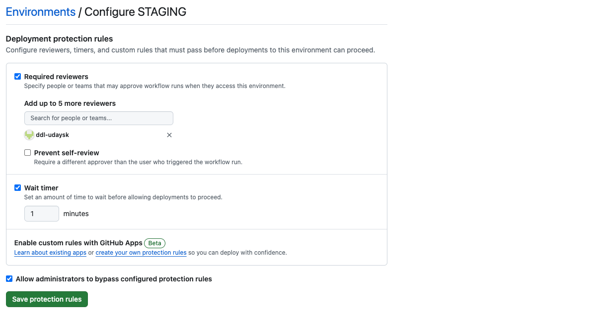

# Domino MLOps Templates

Welcome to the Domino MLOps solution repository! This project serves as a comprehensive starting point for implementing MLOps within Domino.

MLOps entails a collection of repeatable, automated, and collaborative workflows, incorporating best practices. It empowers teams of ML professionals to efficiently deploy their machine learning models into production after approval from various stages of the ML ops pipeline.

## Project Overview

This solution offers a modular end-to-end approach for MLOps within Domino, covering Jobs, Models, and Apps publishing.

## Prerequisites

- A Domino subscription with host endpoint URL and user API access key.
- A GitHub account capable of creating environments and adding corresponding variables to them.
- Understanding of GitHub workflows.

## Methodology

This project template demonstrates the usage of GitHub Actions workflows for CI/CD and employs Domino Data Planes, representing different hardware tier for different stages of the OPS pipeline.

For this template project, we would establish three Dataplanes representing three stages in the Domino experiment manager.We would create three GitHub environments, each mapping to the corresponding stage in the Dataplane and experiment manager of Domino. Progressing through the CI/CD pipeline involves changing the stage in the experiment manager and approving the stage in GitHub to advance the deployment to next dataplane on domino.

## GitHub

The project utilizes GitHub Actions workflows located in the `.github/workflows/` folder for Jobs, Apps, and Models to deploy them to different hardware tiers(dataplane), representing various stages of ML pipelines.
Users need to register different environments in the github project and the environment variables representing appropriate hardware tiers for that stage in Domino Data Plane.

### Workflow:

1. User creates git based project in domino and creates the project in github with production representing the main branch of the project.
2. User includes the worflows and code in folder src/cicd/ listed the template project for jobs , models and apps.
3. User creates environments in github environments with approvers and corresponding variables and secrets for the environment
4. User adds for jobs, apps and models in the folder src/project and to the corresponding entity.
5. User creates a branch of the project from the main branch and works on the code using Domino workspaces.
6. When the user intends to push the code to production, they merge the code to the main branch, triggering the CI/CD pipeline via GitHub Actions workflows.
7. The approval process from one stage to another involves approving the stage change in the experiment manager for model governed by experiment manager and GitHub or If they are jobs , apps it would be by github environments, which will deploy the resources to appropriate hardware tier representing the dataplane.

### ENVVIRONMENT VARIABLES
    JOB
        DOMINO_JOB_OP
        DOMINO_PROJECT_OWNER : "Domino Project Owner"
        DOMINO_PROJECT_NAME : "Domino Project Name"
        DOMINO_API_HOST : "Domino URL."
        DOMINO_JOB_COMMAND : "Command to run for the job. Command format: 'main.py arg1 arg2'."
        DOMINO_JOB_ID" : "JOB ID to stop the Job."
        DOMINO_JOB_COMMIT_ID" : "Commit Id of the project."
        DOMINO_HARDWARE_TIER_DEV : Name of the hardware tier for dev environment."
        DOMINO_HARDWARE_TIER_STAGE : Name of the hardware tier for stage environment."
        DOMINO_HARDWARE_TIER_PROD : Name of the hardware tier for prod environment."
        DOMINO_JOB_ENVIRONMENT_ID : "Environment Id of the Job."

    MODELS
        DOMINO_MODEL_OP : "create, list or update."
        DOMINO_PROJECT_OWNER : "Domino Project Owner."
        DOMINO_PROJECT_NAME : "Domino Project Name."
        DOMINO_API_HOST : "Domino URL"
        DOMINO_MODEL_NAME : "Name of the model."
        DOMINO_MODEL_DESC : "Description of the model."
        DOMINO_MODEL_FILE : "Name of the model file."
        DOMINO_MODEL_FUNC : Name of the model function."
        DOMINO_MODEL_CE : ID of the model compute environment."
        DOMINO_HARDWARE_TIER_DEV : Name of the hardware tier for dev environment."
        DOMINO_HARDWARE_TIER_STAGE : Name of the hardware tier for stage environment."
        DOMINO_HARDWARE_TIER_PROD : Name of the hardware tier for prod environment."
        DOMINO_ENVIRONMENT_ID : "ID of the model  environment id."
        DOMINO_REGISTERED_MODEL_NAME : "Registered model name"
        DOMINO_REGISTERED_MODEL_VERSION : "Registered model version"
        DOMINO_MODEL_TYPE : "Domino model type based on if its from registry or file. Experiment management = 'registry' or file = 'regular'"
        DOMINO_TARGET_STAGE : Target stage of the model."
        DOMINO_REVIEWER : "Reviewer of the stage change."

    APPS
        DOMINO_PROJECT_OWNER : "Domino Project Owner."
        DOMINO_PROJECT_NAME : "Domino Project Name."
        DOMINO_USER_API_KEY : "Domino user API Key."
        DOMINO_API_HOST : "Domino URL"
        DOMINO_HARDWARE_TIER_DEV : Name of the hardware tier for dev environment."
        DOMINO_HARDWARE_TIER_STAGE : Name of the hardware tier for stage environment."
        DOMINO_HARDWARE_TIER_PROD : Name of the hardware tier for prod environment."

### SECRETS
        DOMINO_USER_API_KEY : "Domino user API Key."
